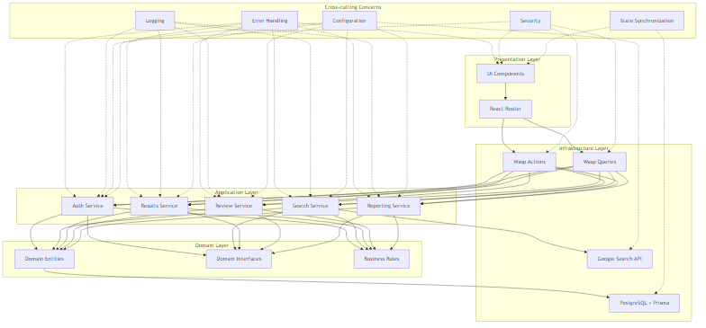
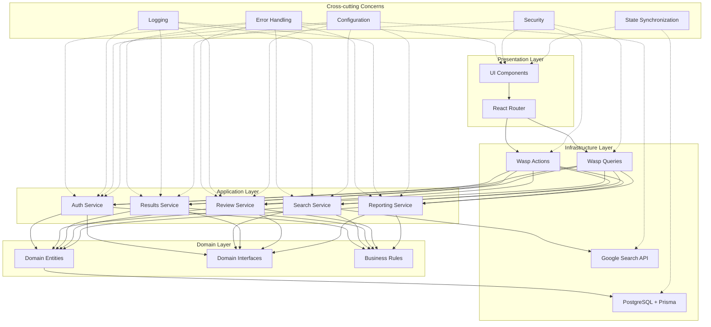

# Thesis Grey Architecture Documentation

## Architecture Overview
Thesis Grey follows a Vertical Slice Architecture (VSA) with CQRS influences, organizing code around features rather than technical layers. This approach provides better cohesion and simpler testing while aligning with the requirements specified in the PRD.



<details>
<summary>Diagram Source</summary>


</details>

## Core Layers

### Domain Layer
The Domain Layer contains the core business entities, interfaces, and business rules that define the application's domain model.

#### Entities
The following entities are defined in schema.prisma:

- **User**: Represents a user of the system with authentication credentials
  - Properties: id, username, email, createdAt, updatedAt
  - Relationships: searchSessions, reviewAssignments

- **SearchSession**: Represents a search session containing multiple search queries
  - Properties: id, name, description, createdAt, updatedAt, userId
  - Relationships: user, searchQueries, searchExecutions, processedResults, reviewTags

- **SearchQuery**: Represents a specific search query within a session
  - Properties: id, query, description, createdAt, updatedAt, sessionId
  - Relationships: searchSession, searchExecutions, rawSearchResults

- **SearchExecution**: Represents the execution of a search query
  - Properties: id, status, startTime, endTime, resultCount, error, queryId, sessionId
  - Relationships: searchQuery, searchSession

- **RawSearchResult**: Represents a raw search result from an external search engine
  - Properties: id, queryId, title, url, snippet, rank, searchEngine, rawResponse
  - Relationships: searchQuery, processedResult

- **ProcessedResult**: Represents a processed search result with normalized data
  - Properties: id, rawResultId, sessionId, title, url, snippet, metadata
  - Relationships: rawSearchResult, searchSession, reviewTags, notes, duplicateOf, duplicates

- **DuplicateRelationship**: Represents a relationship between duplicate search results
  - Properties: id, primaryResultId, duplicateResultId, similarityScore, duplicateType
  - Relationships: primaryResult, duplicateResult

- **ReviewTag**: Represents a tag that can be applied to search results
  - Properties: id, name, color, sessionId
  - Relationships: searchSession, assignments

- **ReviewTagAssignment**: Represents the assignment of a tag to a search result
  - Properties: id, tagId, resultId, assignedAt
  - Relationships: tag, result

- **ReviewAssignment**: Represents a review assignment for a user
  - Properties: id, userId
  - Relationships: user

- **Note**: Represents a note attached to a search result
  - Properties: id, content, createdAt, updatedAt, resultId
  - Relationships: result

#### Interfaces
- **SearchProvider**: Defines the contract for search providers
  ```typescript
  interface SearchProvider {
    executeSearch(query: string, options: SearchOptions): Promise<RawSearchResult[]>;
  }
  ```
- **ResultProcessor**: Defines the contract for processing search results
  ```typescript
  interface ResultProcessor {
    processResult(rawResult: RawSearchResult): Promise<ProcessedResult>;
    detectDuplicates(results: ProcessedResult[]): Promise<DuplicateRelationship[]>;
  }
  ```
- **ReviewManager**: Defines the contract for managing the review process
  ```typescript
  interface ReviewManager {
    createTag(name: string, color: string, sessionId: string): Promise<ReviewTag>;
    assignTag(tagId: string, resultId: string): Promise<ReviewTagAssignment>;
    createNote(content: string, resultId: string): Promise<Note>;
  }
  ```
- **ReportGenerator**: Defines the contract for generating reports
  ```typescript
  interface ReportGenerator {
    generatePrismaFlow(sessionId: string): Promise<PrismaFlowData>;
    generateStatistics(sessionId: string): Promise<SessionStatistics>;
    exportResults(sessionId: string, format: 'csv' | 'json'): Promise<string>;
  }
  ```

#### Business Rules
- Authentication requirements: Users must be authenticated to access the system
- PRISMA workflow compliance: The review process must follow the PRISMA workflow
- Search result processing rules: Results must be normalized and deduplicated

### Application Layer
The Application Layer implements the use cases of the application, orchestrating the flow of data to and from the domain entities.

#### Use Cases
- **User Authentication**: Registration, login, and profile management
- **Search Strategy Building**: Creating and managing search sessions and queries
- **Search Execution**: Executing search queries against external search engines
- **Results Management**: Processing, normalizing, and deduplicating search results
- **Review Process**: Tagging, annotating, and reviewing search results
- **Reporting**: Generating reports and exporting data

#### Services
- **AuthService**: Handles user authentication and authorization
- **SearchService**: Manages search sessions and queries
- **ResultsService**: Processes and manages search results
- **ReviewService**: Manages the review process
- **ReportingService**: Generates reports and exports data

#### Implementation with Wasp Operations
The application layer is implemented using Wasp's operations system:

```typescript
// Server-side query implementation example
import { HttpError } from 'wasp/server';
import { type GetSearchSessions } from 'wasp/server/operations';

export const getSearchSessions = (async (args, context) => {
  if (!context.user) {
    throw new HttpError(401, 'Not authorized');
  }

  try {
    const sessions = await context.entities.SearchSession.findMany({
      where: { userId: context.user.id },
      orderBy: { createdAt: 'desc' },
      select: {
        id: true,
        name: true,
        description: true,
        createdAt: true,
        updatedAt: true,
        _count: {
          select: {
            searchQueries: true,
            processedResults: true
          }
        }
      }
    });

    return sessions;
  } catch (error) {
    console.error('Error fetching search sessions:', error);
    throw new HttpError(500, 'Failed to fetch search sessions');
  }
}) satisfies GetSearchSessions;
```

#### State Management
- Server-side state with client-side caching using React Query (provided by Wasp)
- Optimistic UI updates for a responsive user experience

### Infrastructure Layer
The Infrastructure Layer provides technical capabilities to support the application.

#### External Services
- **Google Search API via Serper**: Provides search results from Google

#### Persistence
- **PostgreSQL**: Relational database for storing application data
- **Prisma ORM**: Object-Relational Mapping for database access
  - All entities defined in schema.prisma
  - Accessed via context.entities in Wasp operations

#### Authentication
- **Wasp Authentication System**: Uses Wasp v0.16.0's built-in auth system
  - JWT-based token management
  - User registration and login flows
  - Protected routes with authRequired property
  - Custom signup fields with userSignupFields

```wasp
auth: {
  userEntity: User,
  methods: {
    usernameAndPassword: {
      userSignupFields: import { userSignupFields } from "@src/server/auth/userSignupFields.ts"
    }
  },
  onAuthFailedRedirectTo: "/login",
  onBeforeSignup: import { onBeforeSignup } from "@src/server/auth/hooks.ts",
}
```

#### Communication
- **RESTful API endpoints**: Wasp actions and queries for client-server communication
- **TypeScript Type Safety**: End-to-end type safety with auto-generated types

## Presentation Layer
The Presentation Layer is responsible for the user interface and user interactions.

### Components
- **Auth Components**: Login and registration forms
- **SearchStrategy Components**: Search session and query management
- **ResultsManager Components**: Results viewing and processing
- **ReviewResults Components**: Review interface with tagging
- **Reporting Components**: Report generation and export

### Routing
- Implemented with Wasp's built-in routing system using React Router

```wasp
route LoginRoute { path: "/login", to: LoginPage }
page LoginPage {
  component: import { LoginPage } from "@src/client/auth/pages/LoginPage"
}

route ProfileRoute { path: "/profile", to: ProfilePage }
page ProfilePage {
  component: import { ProfilePage } from "@src/client/auth/pages/ProfilePage",
  authRequired: true
}
```

### Data Fetching
- Implemented with Wasp's React Query integration
- Type-safe client-server communication

```tsx
import { useQuery } from 'wasp/client/operations';

function SearchSessionsList() {
  const { data: sessions, isLoading, error } = useQuery(getSearchSessions);
  
  if (isLoading) return <p>Loading...</p>;
  if (error) return <p>Error: {error.message}</p>;
  
  return (
    <ul>
      {sessions.map(session => (
        <li key={session.id}>{session.name}</li>
      ))}
    </ul>
  );
}
```

## Cross-cutting Concerns

### Error Handling
- Client-side: React error boundaries and try/catch blocks
- Server-side: Wasp's HttpError and global error handlers

```typescript
import { HttpError } from 'wasp/server';

if (!session) {
  throw new HttpError(404, 'Session not found');
}
```

### Security
- **Authentication**: JWT-based authentication with Wasp's auth system
- **Authorization**: Access control in operations using context.user
- **Input Validation**: Validation in operations and components
- **HTTPS**: Secure communications

### Logging
- Server-side logging for operations and errors
- Client-side error tracking

### Configuration
- Environment variables for API keys and database connection
- Wasp-specific configuration in main.wasp

## Deployment

The application can be deployed using Wasp's built-in deployment capabilities:

- Local development: `wasp start`
- Production build: `wasp build`
- Fly.io deployment: `wasp deploy fly`
- Docker containerization: `wasp build` generates Dockerfile
